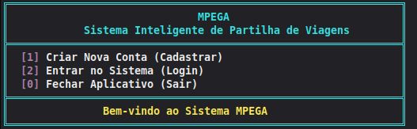
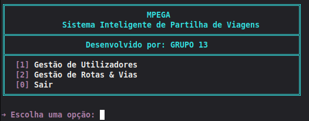
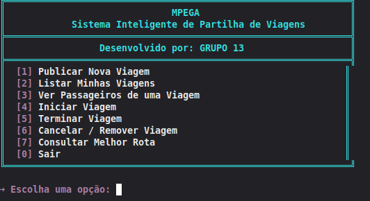
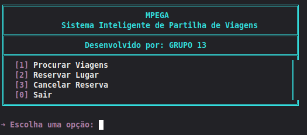

# <h1 align="center">MPEGA</h1>

<h3 align="center">
Sistema Inteligente de Partilha de Viagens
</h3>

<p align="center">
Projeto desenvolvido no âmbito da disciplina de <strong>Estruturas de Dados II</strong>
</p>

---

# Integrantes

- **Briana Vicente** — 2023-2111
- **Delfina Ramos** — 2023-0596
- **Rodolfo Guzman** — 2023-0090

---

# Sobre o Projeto

O **MPEGA** é uma aplicação de consola desenvolvida em linguagem **C** que tem como objetivo facilitar a partilha de viagens entre condutores e passageiros.

O sistema permite o registo e autenticação de utilizadores, gestão de cidades e rotas, publicação de viagens, reservas de lugares e consulta do melhor percurso entre duas cidades através do algoritmo de **Dijkstra**.

Toda a informação é armazenada em ficheiros de texto, garantindo a persistência dos dados entre diferentes execuções da aplicação.

---

# Funcionalidades

## Administrador

- Registar utilizadores;
- Atualizar utilizadores;
- Bloquear e desbloquear utilizadores;
- Remover utilizadores;
- Listar utilizadores;
- Registar cidades;
- Remover cidades;
- Registar rotas;
- Remover rotas;
- Atualizar o estado das vias;
- Consultar o melhor percurso entre cidades.

---

## Condutor

- Publicar viagens;
- Listar as suas viagens;
- Iniciar viagens;
- Terminar viagens;
- Cancelar viagens;
- Consultar passageiros inscritos;
- Consultar a melhor rota para um destino.

---

## Passageiro

- Procurar viagens;
- Reservar lugar;
- Cancelar reserva;
- Consultar viagens disponíveis.

---

# Tecnologias Utilizadas

- Linguagem C
- Programação Modular
- Ficheiros de Texto

---

# Estruturas de Dados Utilizadas

- Tabela Hash
- Lista Ligada
- Grafo

---

# Estrutura do Projeto

```text
ExameEDII_T3_G13
│   ├── imagens
│   │   ├── adm.png
│   │   ├── condutor.png
│   │   ├── login.png
│   │   └── passageiro.png
│   ├── Projecto
│   │   ├── cidades.txt
│   │   ├── dashboard.c
│   │   ├── dashboard.h
│   │   ├── executavel
│   │   ├── ficheiros.c
│   │   ├── ficheiros.h
│   │   ├── grafo.c
│   │   ├── grafo.h
│   │   ├── hash.c
│   │   ├── hash.h
│   │   ├── lista.c
│   │   ├── lista.h
│   │   ├── mainMPega.c
│   │   ├── reservas.txt
│   │   ├── rotas.txt
│   │   ├── tipos.h
│   │   ├── usuarios.txt
│   │   ├── viagem.c
│   │   ├── viagem.h
│   │   └── viagens.txt
│   ├── README.md
│   ├── Relatorio_T3_G13.pdf
│   └── TrabalhoFinal_EDII_2026.pdf

```

---

# Persistência dos Dados

O sistema guarda automaticamente todas as informações nos seguintes ficheiros:

| Ficheiro | Informação armazenada |
|----------|----------------------|
| **usuarios.txt** | Utilizadores |
| **cidades.txt** | Cidades |
| **rotas.txt** | Rotas |
| **viagens.txt** | Viagens |
| **reservas.txt** | Reservas dos passageiros |

Desta forma, nenhuma informação é perdida quando a aplicação é encerrada.

---

# Módulos do Sistema

## Hash

Responsável pela gestão dos utilizadores, autenticação e controlo dos perfis através de uma Tabela Hash.

---

## Grafo

Responsável pela gestão das cidades e rotas, bem como pela determinação do melhor percurso utilizando o algoritmo de Dijkstra.

---

## Viagem

Responsável pela publicação, pesquisa, reserva, cancelamento e gestão das viagens.

---

## Ficheiros

Responsável por guardar e carregar todas as informações do sistema.

---

## Dashboard

Responsável pelos menus, navegação e interação entre o utilizador e o sistema.

---

# Compilação

```bash
gcc *.c -Wall -Wextra -Werror -o executavel
```

---

# Execução

```bash
./executavel
```

---

# Interface do Sistema

## Menu Inicial

<p align="center">

</p>

---

## Menu do Administrador

<p align="center">

</p>

---

## Menu do Condutor

<p align="center">

</p>

---

## Menu do Passageiro

<p align="center">

</p>

---

# Futuras Melhorias

- Melhorar o algoritmo de procura de viagens.
- Implementar filtros avançados de pesquisa.
- Adicionar histórico de viagens.
- Desenvolver uma interface gráfica.
- Implementar notificações aos utilizadores.

---

# Licença

Projeto desenvolvido exclusivamente para fins académicos no âmbito da disciplina de **Estruturas de Dados II**.

---

<h3 align="center">
MPEGA — Sistema Inteligente de Partilha de Viagens
</h3>

<p align="center">
Desenvolvido pelo Grupo 13
</p>
